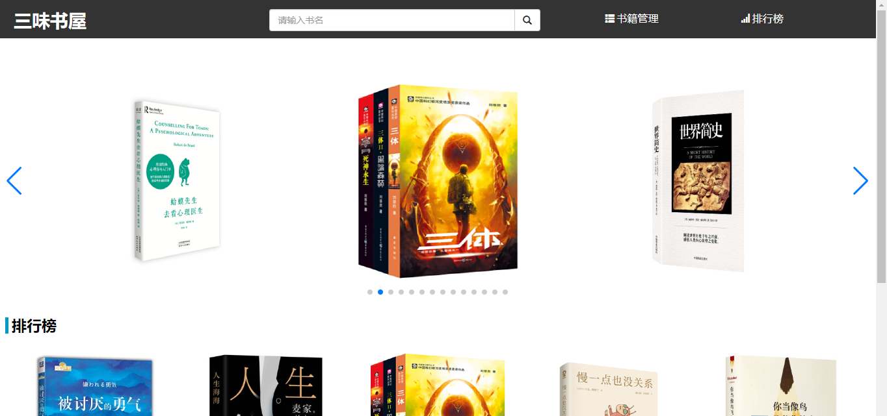
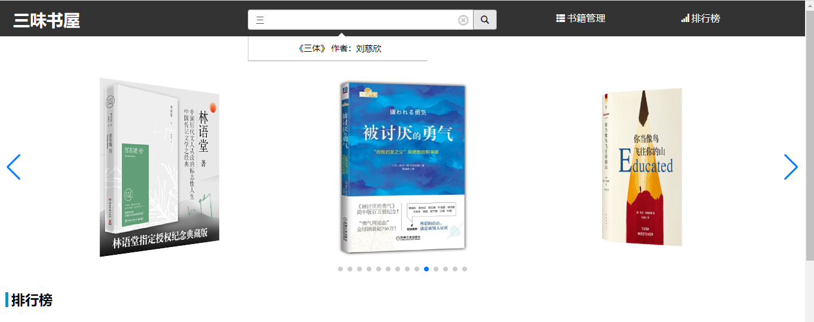
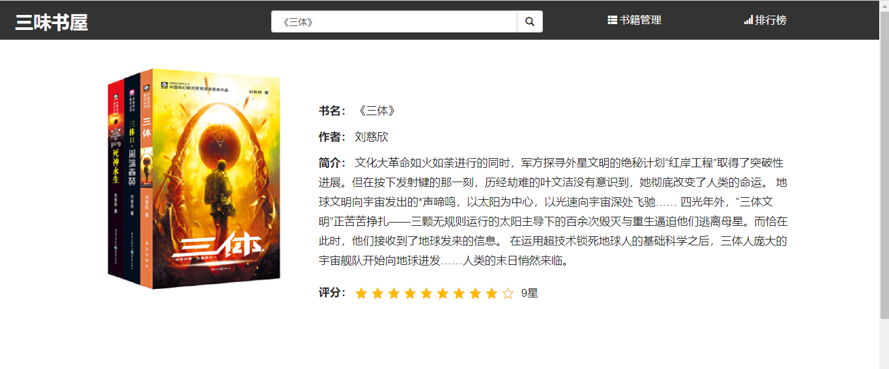
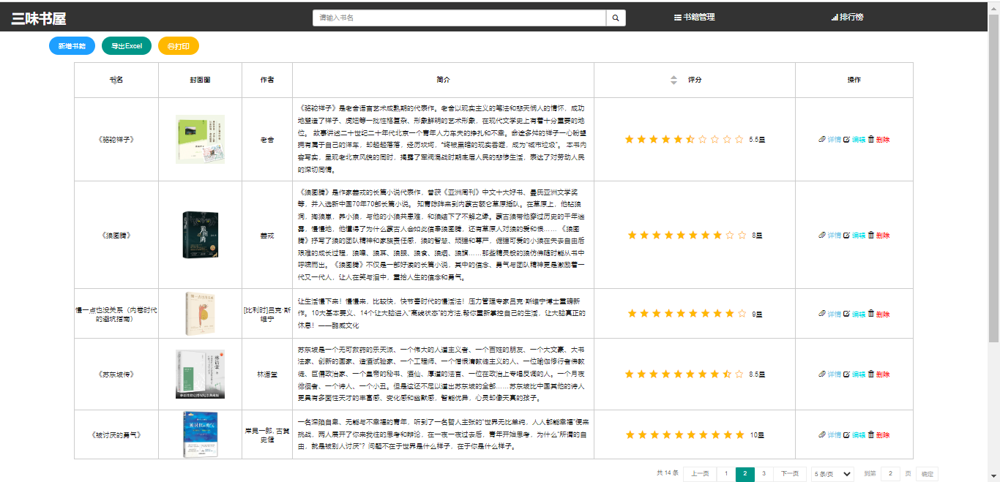
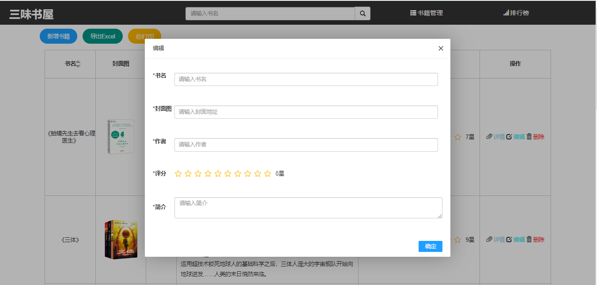
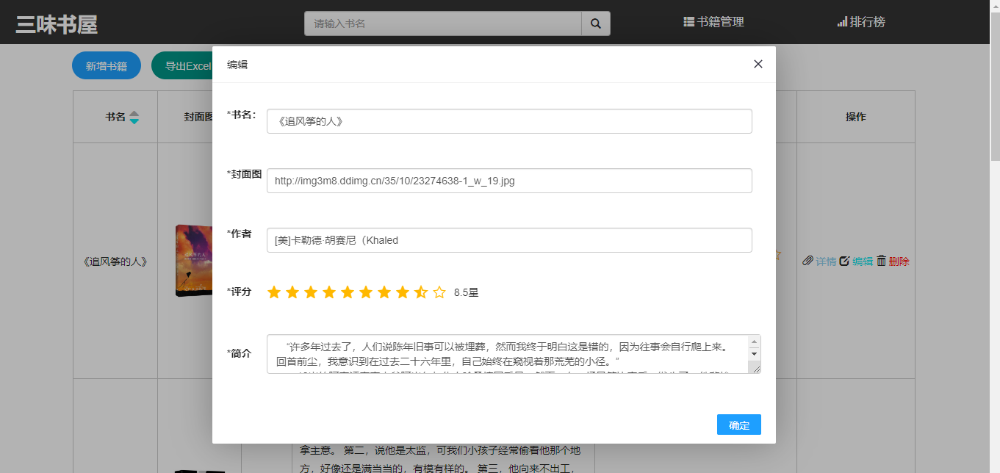
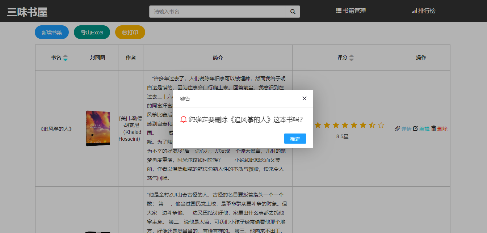
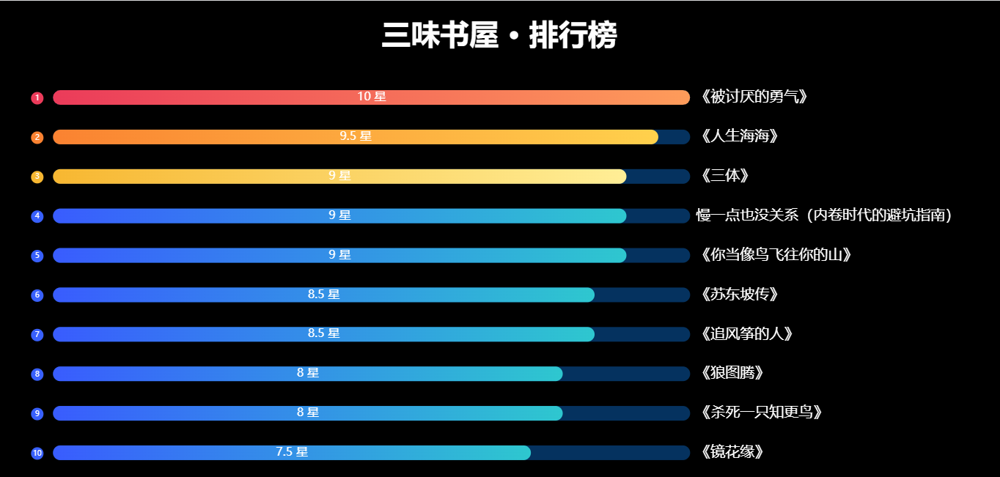
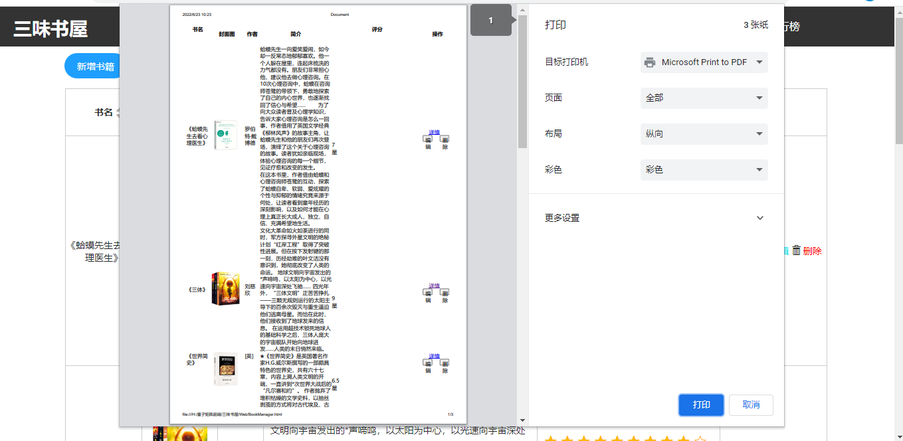
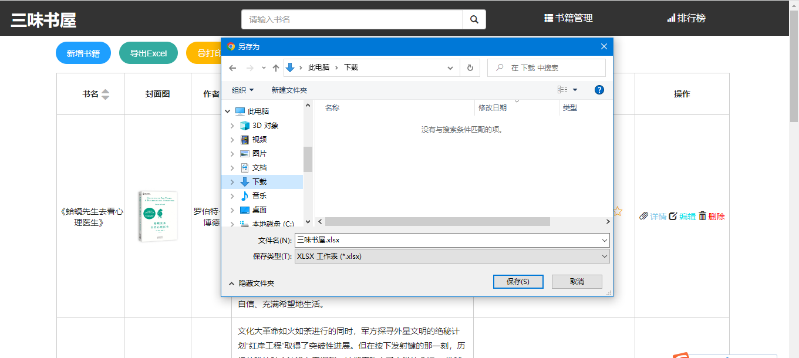

# 三味书屋
这是一个使用jQuery+ json-server（服务器） +   Echarts +其他小插件，开发的一个简单的图书管理小项目

## 功能列表
- 漂亮的登录页面
- 漂亮的排行榜
- 评分功能
- 添加书籍
- 修改书籍
- 删除书籍
- 模糊查询
- 分页
- 后端排序
- 导出为Excel
- 打印

## 服务器启动指令
```bash
npm run start
```

## 部分截图

###### 首页：



###### 搜索功能：



###### 详情页面：



###### 管理页面：



###### 新增页面：



###### 编辑页面：



###### 删除页面：



###### 排行榜页面：



###### 打印功能：



###### 导出表格功能：

